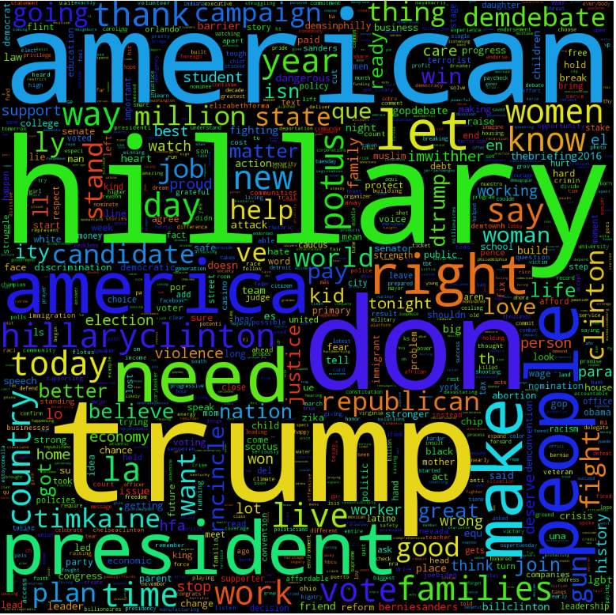

# Donald Trump Word Cloud #
I created this word cloud from 3223 tweets by <a href="https://twitter.com/realDonaldTrump" target="_blank">@realDonaldTrump</a>. It's not as exciting as I had hoped it would be.  

Special thanks to the <a href="https://github.com/tweepy/tweepy" target="_blank">tweepy</a> module for accessing twitter data in python, <a href="https://gist.github.com/yanofsky/5436496" target="_blank">yanofsky's</a> script to download twitter posts to CSV, and finally to <a href="https://www.kaggle.com/gruevyhat/d/kzaman/how-isis-uses-twitter/militant-extremist-wordcloud" target="_blank">gruevyhat's</a> for his inspiration after he created the militant extremist word cloud.

# Hillary Clinton tweet word cloud #

Special thanks again to the <a href="https://github.com/tweepy/tweepy" target="_blank">tweepy</a> module for accessing twitter data in python, <a href="https://gist.github.com/yanofsky/5436496" target="_blank">yanofsky's</a> script to download twitter posts to CSV, and finally to <a href="https://www.kaggle.com/gruevyhat/d/kzaman/how-isis-uses-twitter/militant-extremist-wordcloud" target="_blank">gruevyhat's</a> for his inspiration after he created the militant extremist word cloud.  

